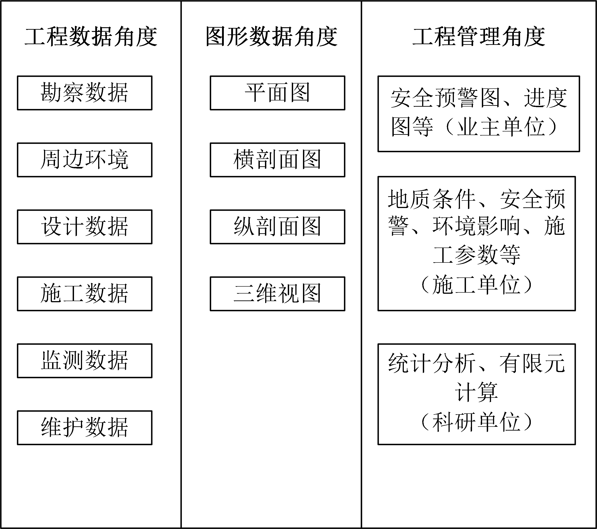
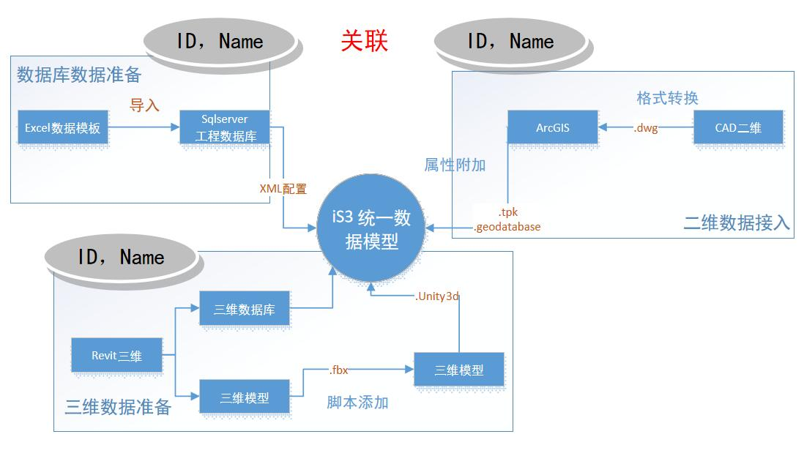
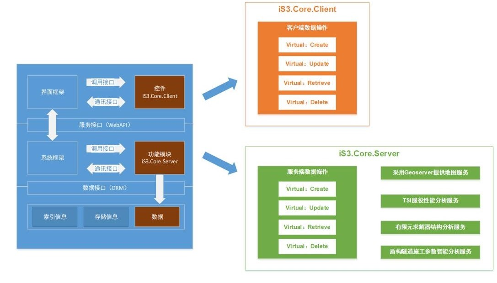
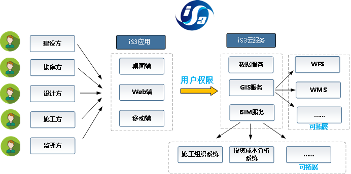

# 平台架构

## iS3系统总体架构

软件总体框架包含四层，分别是数据层、服务层、应用框架层以及应用层，如下图所示。

数据层提供数据标准格式，实现各种类型数据的对接，如BIM、GIS及各类数据库、倾斜摄影、激光扫描等数据，并支持数据的增删改查。

服务层实现数据的云存储，提供数据访问组件，通过WebAPI实现各类数据的增删改查，并提供数据的各类分析功能，如结构分析、服役性能分析、调度服务及地图服务。

应用框架层分为桌面端、Web端、移动端，桌面端已较为完善，Web端和移动端处于研发阶段。

应用层则是基于应用框架层，根据工程实际应用需求设计应用。

iS3平台以`iS3 Core`为基础，提供IS3数据接口、功能接口、扩展接口等一系列核心功能定义，是进行IS3二次开发的关键。

在iS3 核心框架下，iS3平台前端主要包括服务器端(iS3 Server)、桌面端(iS3 Desktop)、移动端(iS3 Mobile)和云服务端(iS3 Cloud)，做到了一套数据，一个底层平台，跨平台显示的效果。

目前iS3平台主要依托桌面端，移动端和云端也在不断的开发完善中，相关SDK也会在之后一段时间陆续发布。

## iS3数据层架构

iS3平台的数据架构思路可以从工程数据、图形数据和工程管理这三个方面来进行阐述。如下图所示：

### 工程数据角度

地下工程结构在勘测、设计和施工过程中将涉及到众多数据，对这些数据可以做如下划分：

地质勘测数据：工程地质数据（钻孔、地层、土层特性等）、水文地质数据（潜水、承压水等）

设计数据：衬砌环设计、线路设计、车站设计等

施工数据：盾构机推进参数、推进进度等

监测数据：土压力计示数、维护墙位移、衬砌环倾角及位移等

维护管理数据：温湿度信息、灾害预警装置数据等

在iS3平台中，工程数据存储在数据库中。

### 图形数据角度

图形数据主要指工程相关的CAD图纸，包括工程设计阶段的各种平面图、横剖面图、纵剖面图和三维视图等。这类数据是对工程的最直观显示，含有地下工程结构的详细尺寸数据等信息。同时，后期也将以这些CAD图纸为依据对地下建筑工程进行三维建模，实现工程的三维可视化。

iS3平台中，在考虑CAD数据要跟数据库中工程数据分类合理关联的基础上对CAD图层进行编辑，然后导入到ArcGIS软件，以ArcGIS图层的形式存储CAD数据。此外，平台还需要配置地图数据作为地下结构工程的底图，为了获得良好的用户体验，同时又保证满足精度要求，将底图制作成切片以减小地图缩放时的内存占用。

### 工程管理角度

从对工程的管理角度来看，项目中不同的角色将对iS3平台提出不同的功能需求：项目业主的领导层比较关注工程的整体施工进度，以及工程是否安全顺利；项目经理的关注重点是本项目标段的进度如何；施工队伍比较关注下一个施工段前方的地质条件情况如何，施工是否安全等。现阶段，iS3平台的工程管理视图功能在不断开发中。

### 	统一数据模型

iS3平台将不同数据类型的数据整合在一起，形成了一个统一的数据模型，如下图所示：

### 	数据组织

iS3平台将不同项目以Project划分，每个Project之下分为不同Domain（域），其中有很多DGObjects（数字化对象组），每个DGObjects是许多DGObject（数字化对象）的集合。

上图中：

蓝色块的含义：平台专有概念对应的类；

橙色块和黄色块的含义：该类下的成员。

## iS3服务层架构

服务层是为应用层提供数据访问接口、分析服务接口的逻辑层，由iS3服务端 (`iS3 Server`) 提供。服务层一方面简化、统一了数据访问的方式和底层硬件设备的调用方式，另一方面则保证了数据的安全性，不被随意访问、改动和删除。

服务层根据分析目标的不同，采取不同的分析手段进行分析，包括：数学分析、空间分析、数字--数值一体化分析、大数据分析、云计算等等。

空间分析是在数据模型的基础上，基于二维、三维几何属性，提取空间上有用信息，找出数据在空间上的规律与联系，其中二维空间分析包括范围查询、长度面积测量、空间变换和网络优化等，三维空间分析则包括土方填挖方分析、隧道剖面分析、地质剖面分析、几何空间碰撞分析等。数字-数值一体化分析的基本思路是在iS3中，以数字模型为基础，获取数值分析数据，如几何属性、材料数据、荷载数据等，并自动化生成数值分析前处理模型，通过数据文件在有限元数值软件中完成分析工作，最后再将计算结果传回iS3系统。

由于决策与服务与具体的工程应用需求相关，因此服务对象的不同，服务的内容与所需要决策的内容也就不同。iS3是一个开源的、开放的平台，用户可以针对自己的需求，构建满足决策与应用的专业服务模块。为了拓展服务层的服务功能范围，iS3在统一数据模型的基础上，提供了对外开放的、可扩展的数据接口，并提供了二次开发的案例作为参考，为分析功能的定制与开发奠定了坚实的基础。

## iS3应用层架构

平台将跨平台推出客户端，包括桌面端、Web端以及移动端。工程用户（建设方、勘查方、设计方、施工方、监理方）在不同的应用场景下选择适合的客户端对项目进行管理，如上图所示。

根据的用户权限，平台会对用户开放相应的服务，包括数据服务、GIS服务以及BIM服务，并支持用户自行构建满足决策与应用的专业服务模块。

为了拓展云服务的服务功能范围，平台在统一数据模型的基础上，提供了对外开放的、可扩展的数据接口，为分析功能的定制与开发奠定了坚实的基础。

用户在调用GIS服务和BIM服务的时候，通过iS3云服务中的数据服务，可根据用户权限对相应模块的数据进行操作，实现管理工程的协同工作。

