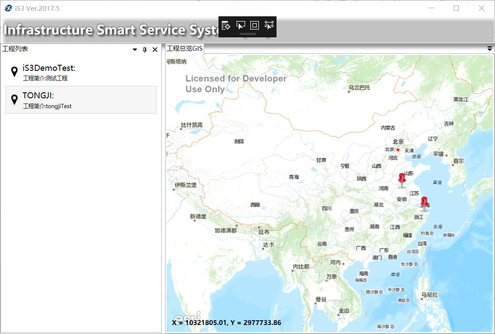
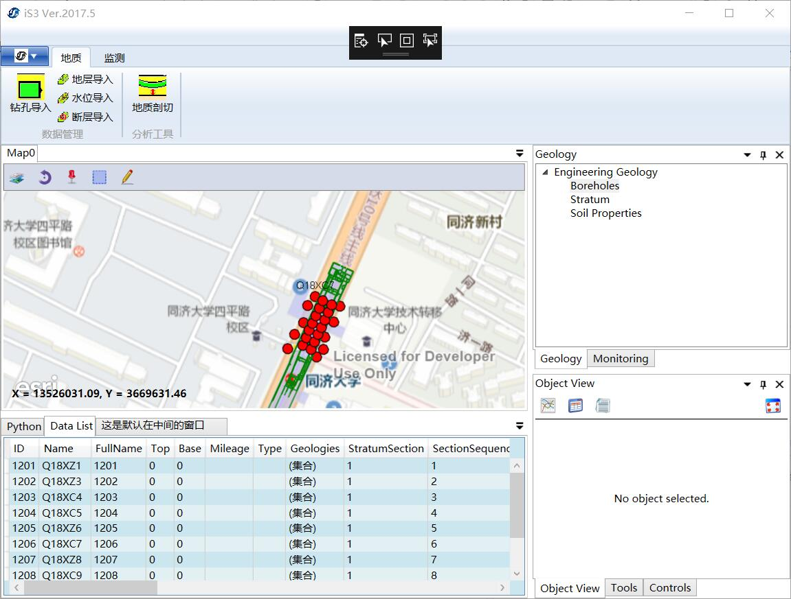

# 界面说明

本章以`TONGJI`项目为例。

点击桌面图标**基础设施智慧服务系统（iS3）**，运行 iS3 平台。

## 服务器连接配置界面

点击系统配置，可配置服务地址以及服务端口。

## 平台登录界面

在登录界面，输入账号、密码（默认账号：Admin，默认密码：Admin），点击用户登录，即可登录平台。 

## 工程选择界面

点击左边工程列表或点击右边地图图标均可选择相应工程，**右键**点击地图上图标，选择**进入工程**，进入工程主界面。

## 工程主界面

点击主界面二维、三维或者数据表，均可选择相应对应并进行数据查看。

## 工程主界面详细介绍

①代表：二三维展示区

②代表：分别为 Python 编译器和数据表格区

③代表：工程数据列表区

④代表：分别为对象信息查看区和拓展工具区

