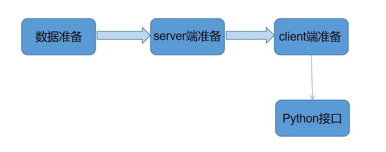

# 平台使用

本部分将对iS3平台的使用进行介绍，并以TONGJI项目为例，详细解释了用户应该如何将自己的数据部署到iS3平台上来。

使用平台前，需先在github平台上下载iS3平台Server端、Client端源码并下载TONGJI样例项目需使用的数据文件。

源码下载链接：[https://github.com/XLab-Tongji/iS3_2.0_Demo](https://github.com/XLab-Tongji/iS3_2.0_Demo)。

数据文件下载链接：[https://pan.baidu.com/s/1EHNrcQpZIfqYJiVlxgqm3A](https://pan.baidu.com/s/1EHNrcQpZIfqYJiVlxgqm3A )，提取码：2cfs

本部分分为五章，[数据准备](./section1.md)是基础，之后进行[server端准备](./section2.md)，最后进行[client端准备](./section3.md)。[相关接口](./section4.md)与平台的二次开发有关，有此方面需求的用户可以进行了解。 [Python开发说明](./section5.md)则对平台的Python开发方式进行进一步说明。

   * [数据准备](./section1.md)

   * [server端准备](./section2.md)

   * [client端准备](./section3.md)

   * [相关接口](./section4.md)

   * [Python开发说明](./section5.md)

