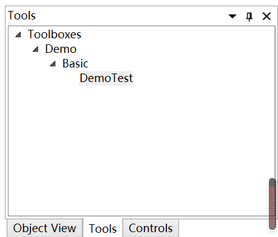
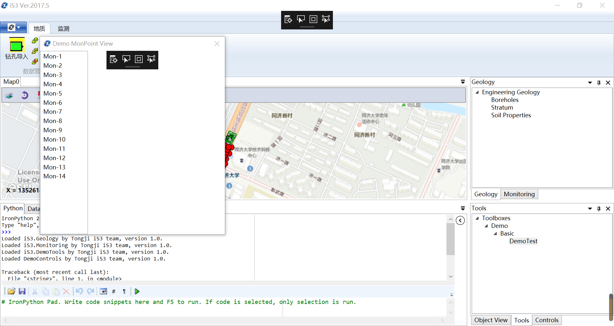
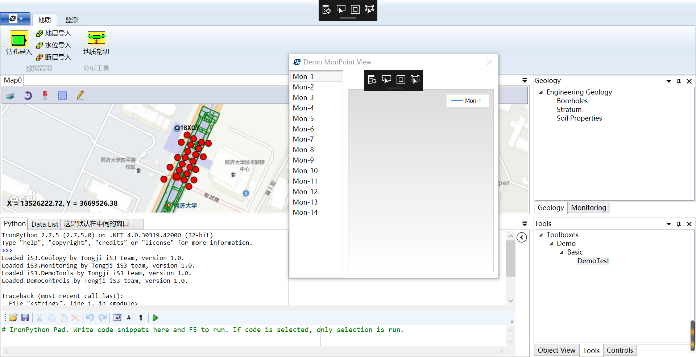

# DemoTool简要说明

`DemoTool`是一个简单的小工具，可以展示所有`MonPoint`监测点以及相应的监测曲线（尚未定义）。此处将对`DemoTool`的使用进行简要说明。

首先进入到某个iS3工程项目，点击右下角的Tools面板，可以看到Tools下有Toolboxes->Demo->Basic->DemoTest的层级关系，其中DemoTest即为本DemoTool的标识。

点击该“DemoTest”字样，弹出“Demo MonPoint View”视图窗口，该视图左侧展示该工程项目中所有的`MonPoint`监测点的名称。

点击左侧列表中任意监测点（此处点击Mon-1），右侧即显示相应监测点的监测曲线（尚未定义），并在地图上将对应监测点的图标高亮。如下图所示：

