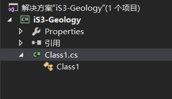
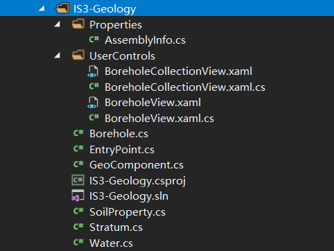

# 创建拓展项目

自定义数字化对象类（此处为地质数据类），首先需要在`iS3-Desktop-Client/IS3-Extensions`路径下新建一个名为`IS3-Geology`的解决方案，用于存放与自定义地质数据类有关的文件。以Visual Studio 2017的运行环境为例，此处将演示如何创建`IS3-Geology`地质数据拓展项目。

在Visual Studio里选择 *文件->新建->项目*，打开 *新建项目示例*，选择 *其他语言-> Visual C＃-> Windows经典桌面->类库（.NET Framework）*，名称为“ iS3-”加域名（此处为`iS3-Geology`），路径为`iS3-Desktop-Client/IS3-Extensions`。如果域名不以iS3-开头，项目会启动失败。

创建结果如下图所示。创建完毕后，用户将在该项目下添加各种文件，如`EntryPoint`类、自定义的数字化对象等。具体需要添加的文件将在后面小节进行介绍。

待添加完各种所需的文件后，该项目的最终目录结构如下所示：

**文件说明：**

- `EntryPoint.cs`：该类是拓展库的入口。
- `Borehole.cs`等：这些类是实现具体数据对象的类，继承自`DGObject`类。
- `IS3-Geology.csproj`：该文件是新建项目时生成的C#项目文件。
- 其他：数据对象类功能实现的辅助类。

